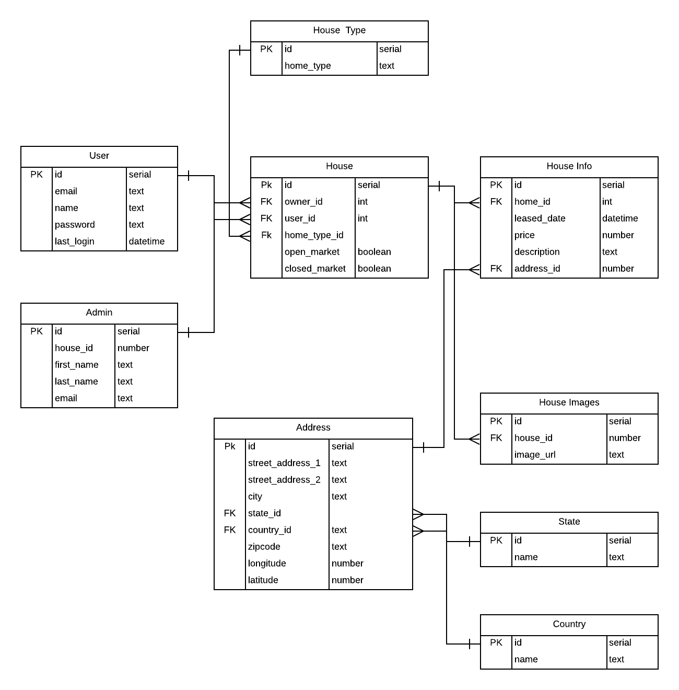

# SQL Database

## Model

    

### Entities for the System

Every Record will have:

1. Created At - datetime
1. Updated At - datetime
1. Deleted At - datetime

- [x] Admin

- [x] Student/User

- [x] House

- [x] House Info

- [x] Address
